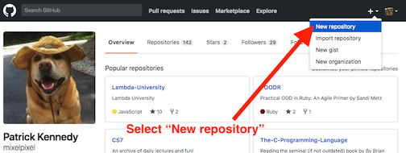
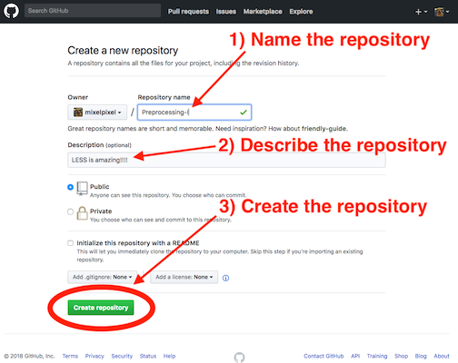
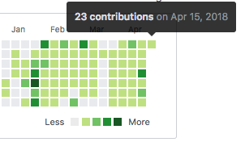
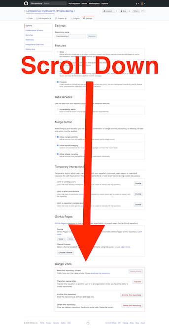
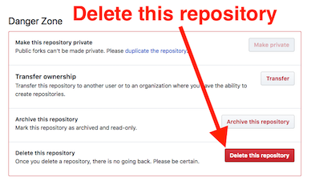
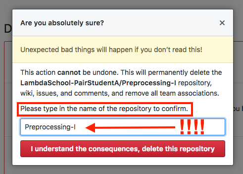

# Lambda School Code Review Checklist

Code review is the time to catch issues and help students who don't understand concepts from the day or week. A thorough code review may take between 90-120 minutes, but you can do a condensed code review in about 30 minutes. Instructors, PMs, or peer mentors will use the code review as an opportunity to push and challenge you technically. While you should feel free to ask questions, you should also be ready to explain and defend your code.

## Part I - Review Projects

Review each project, including assignments, personal projects, or Sprint Challenges since the last code review. At a minimum, review the code for the following:

1. Each project is pushed to GitHub with clear, detailed commit messages.
2. Each project is feature complete and works as expected.
3. There are no exceptions or warnings.
4. Code follows consistent naming conventions, language idioms, and style.
5. Code is written by the student.

## Part II - Review Objectives

Objectives are written in our 'Student can...' format, and reflect the skills the student will have demonstrated in their project, assignment, or sprint challenge. Using the student's tracker, review each competency or objective in each sample of code, and determine a rating (0-3) on each one.

Ask to see examples of each objective in the project. Ask the student to explain the code and how it demonstrates their mastery.

#### Rating Scale

| Score | Description |
| :-- | :-- |
| 0       				| Not observable |
| 1       				| Does not understand, does not meet expectations |
| 2 <sup>*</sup>  | Understands with assistance, meets expectations |
| 3       				| Understands independently, exceeds expectations |

<sup>*</sup> `2` is the default score. A `3` should only be awarded when the student has demonstrably mastered the objective.

##### NOTE: Ratings are not grades, and there are no GPAs. Students and reviewers should come to a consensus rating to understand where the student excels, and where the student may need some extra attention or help.

## Part III - Review Past Objectives

Choose a handful of previous objectives to review or discuss. If the code review is happening in a peer mentoring setting, this will likely happen with one student reviewing another's code.

Focus on objectives where the student did not meet expectations. If the student has reviewed and improved, update the score. Otherwise, address the concerns in this step, or when making a plan.

## Part IV - Make a Plan

Make a plan. Focus on fixing deficiencies first, then focus on mastery, stretch goals, or other advanced work.

Plans should include videos, resources, or exercises the student will complete in order to improve their mastery.

## Part V - Address Any Additional Needs

If there are any specific needs or concerns with the student, share them with a PM or Instructor.

## Part VI - Student Pull Request Feedback Template

```markdown
## Great

## Requested Improvements

## Questions

## Rating: {1-3}

#### GitHub Contribution Graph
```

## Part VII - GitHub Contribution Graph


### Please take a moment to review GitHub's "[Learn How We Count Contributions](https://help.github.com/articles/why-are-my-contributions-not-showing-up-on-my-profile)" page. In particular the "[Commit Was Made In A Fork](https://help.github.com/articles/why-are-my-contributions-not-showing-up-on-my-profile/#commit-was-made-in-a-fork)" section. If you'd like all of your work to be reflected on your GitHub Contribution Graph, you can do the following:

1. If you want the new project name to match the old one, rename or delete your forked GitHub repository. Do this _**on**__ GitHub (do not delete your local copy!) You can access the renaming and deleting options on GitHub in the "Settings" tab of your fork. Don't worry, your local copy will be safe even if you delete your GitHub fork.


2. Create a new empty repository on GitHub. Give it the name of the project you are "de-forking".





3. Add the new (and empty) GitHub repository as the "origin" remote to your local git repository.

```console
$  git remote -v
   origin  https://github.com/LambdaSchool-PairStudentA/Preprocessing-I.git (fetch) <--- OLD
   origin  https://github.com/LambdaSchool-PairStudentA/Preprocessing-I.git (push) <---- OLD
$  git remote set-url origin https://github.com/mixelpixel/Preprocessing-I.git <-------- NEW
$  git remote -v
   origin  https://github.com/mixelpixel/Preprocessing-I.git (fetch) <------------------ NEW
   origin  https://github.com/mixelpixel/Preprocessing-I.git (push) >------------------- NEW
```

4. Push the project to the new reporepository.

```console
$  git push origin master
   Counting objects: 111, done.
   Delta compression using up to 4 threads.
   Compressing objects: 100% (77/77), done.
   Writing objects: 100% (111/111), 594.93 KiB | 45.76 MiB/s, done.
   Total 111 (delta 27), reused 111 (delta 27)
   remote: Resolving deltas: 100% (27/27), done.
   To https://github.com/mixelpixel/Preprocessing-I.git
   * [new branch]      master -> master
```


  - The old contribution count:

  

  - The new contribution count:

  

5. Optionally, you can now delete the old GitHub repo.




[](https://youtu.be/siwpn14IE7E)


